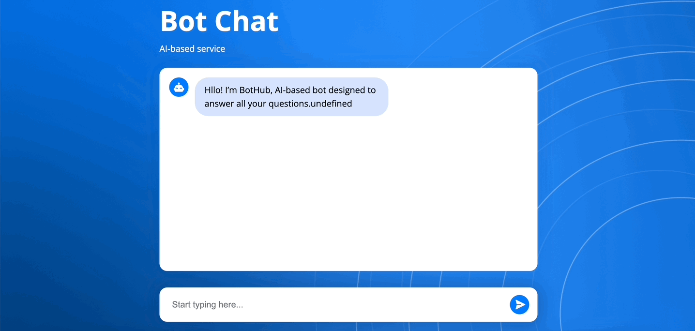

# Bot Chat
Этот проект был сделан как тестовое задание и представляет собой чат с ботом, разработанный с использованием React и TypeScript. Ответы бота отображаются посимвольно, так как ответы возвращаются в формате чанков.

<details>
<summary>Демо</summary>

</details>

## Дизайн
Дизайн компонента можно найти [по ссылке](https://www.figma.com/file/ajCiNj9kSJHxEQkGlfxBqv/BIT-%D0%A2%D0%B5%D1%81%D1%82%D0%BE%D0%B2%D0%BE%D0%B5?type=design&node-id=0%3A1&mode=dev)

## Эндпоинт
URL эндпоинта для отправки сообщений боту:
```
http://185.46.8.130/api/v1/chat/send-message.
```
Метод запроса: POST.
Тело запроса должно быть в формате JSON и содержать поле message со значением типа string, которое представляет собой сообщение, отправляемое боту.

## Технологии
 - React с TypeScript
 - SCSS/SASS modules
 - JS Streams
 - Vite

<details>
<summary>Здание</summary>

Нужно сделать переиспользуемый адаптивный компонент чата. 

Подробное описание задания:
Пользователь должен иметь возможность "переписываться" с ботом. Механика - как в любом стандартном чате. Каждое сообщение должно иметь аватар отправителя (на данном этапе моковой картинке как в фигме будет достаточно) и сам текст сообщения. В зависимости от размера сообщения контейнер сообщения должен иметь определенную длину и ширину. 

Дизайн компонента https://www.figma.com/file/ajCiNj9kSJHxEQkGlfxBqv/BotHub-%D0%A2%D0%B5%D1%81%D1%82%D0%BE%D0%B2%D0%BE%D0%B5?type=design&node-id=0%3A1&mode=design&t=Ck869TKEJyrE0YWI-1

Эндпоинт: http://185.46.8.130/api/v1/chat/send-message
Ответ возвращается в формате чанков поэтому ответ бота должен выводиться буква за буквой. 
Метод запроса: POST
Тело запроса: 
{message: string}

Формат чанка: 
Чанк представляет собой Uint8Array в котором загодирован json формата 
{"status": "content" | "done", "value": "string" | null}
Если статус равен "content" то value содержит символ или часть ответа
В случае если статус равен "done" то value содержит null
Чанков после чанка "done" больше не будет, он является флагом окончания сообщения

Дополнительные задачи (по желанию)
- Добавить анимации при отправке сообщений
- Реализовать возможность остановки потока сообщений от бота (над каждым сообщением добавить кнопку "остановить", по клику на которую бот перестает печатать)

Необходимые технологии:
- React с typescript
- SCSS/SASS modules
- JS Streams
- Vite
</details>